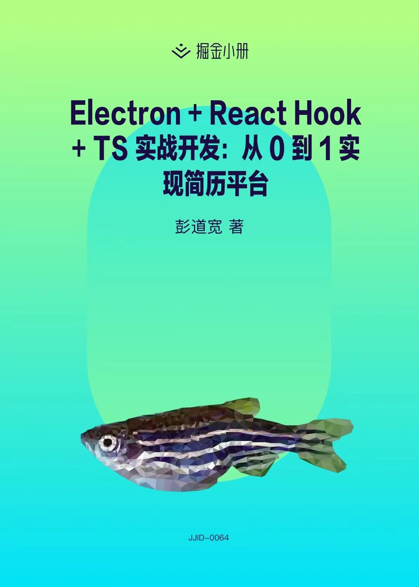

|       Ⅰ        |       Ⅱ        |         Ⅲ          |             Ⅳ              |           Ⅴ            |             VI             |          VII           |      VIII      |       IX       |           X            |
| :------------: | :------------: | :----------------: | :------------------------: | :--------------------: | :------------------------: | :--------------------: | :------------: | :------------: | :--------------------: |
| [前端](#-前端) | [后端](#-后端) | [浏览器](#-浏览器) | [计算机网络](#-计算机网络) | [设计思考](#-设计思考) | [前端工程化](#-前端工程化) | [数据结构](#-数据结构) | [算法](#-算法) | [开源](#-开源) | [思考杂谈](#-思考杂谈) |

  
  

### 关于我

江湖人称“彭于晏广州分晏”，掘金专栏作者，投身开源，rc-redux-model 库作者，你可以加我微信 **PPPengDK**，如果你有问题可以[点击](https://github.com/PDKSophia/blog.io/issues)这里进行留言，我还写了本掘金小册[《Electron + React 从 0 到 1 实现简历平台实战》](https://juejin.cn/book/6950646725295996940)，希望对你有所帮助。

### 有很重要的话要说

所有的内容都是结合自己平常复习、面试、知识查缺补漏、日常工作笔记进行的归纳总结。

大部分知识点是 18、19 年校招面试时复习撰写，阅读过程可能会有些知识陈旧或图裂，如果小伙伴们在阅读过程中发现有歧义。麻烦踢我一下，我会进行修改更正。同时很多文章内容还没补齐，都是从自己的语雀笔记中摘录，大部分是笔记形式，还没整理成文章，但请放心，我会补全。

接下来会有一个复习专区，除了书籍打卡，更多的是一个知识技术体系的梳理和复习，感兴趣看这里 : [read-booklist](https://github.com/PDKSophia/read-booklist)

<!-- 博主是一枚 2019 应届生，因为当时很多大厂的校招已经打响，博主前两天也通过学长学姐们，内推了些大公司，简历一关应该都能过，所以得开始准备一下面试，得复习一哈，在这边的会记录我面试准备看的些书籍和知识点，如果有兴趣的小伙伴，可以看看哦 ~ -->

### 客官，点个赞?

⭐ 如果觉得对您有帮助的话，点个 star 再走？

### 社区帐号

- [博客](https://github.com/PDKSophia/blog.io) `[💻 技术渣渣]`
- [掘金](https://juejin.im/user/594ca8a35188250d892f4139/posts) `[🏷️ 小册作者]`
- [微博](https://weibo.com/u/2971991985) `[🌞 撕逼达人]`
- [小红书](https://www.xiaohongshu.com/user/profile/5b07aa88f7e8b95255c7cdd5?xhsshare=CopyLink&appuid=5b07aa88f7e8b95255c7cdd5&apptime=1626939526) `[👔 穿搭博主]`
- [Bilibili](https://space.bilibili.com/14219999) `[🎤 即将直播]`

### 🐷 前端

前端主要涵盖【HTML】、【CSS】、【JavaScript】、【Vue】、【React】，下面列出高频文章，更多文章请点击这里：[前端文章](./前端/README.md)

> 📢 如果你无法耐得住性子看红皮书，可以看这里 : [📕 JavaScript 高级程序设计第三版红皮书总结](https://github.com/PDKSophia/read-booklist/tree/master/JavaScript%E9%AB%98%E7%BA%A7%E7%BC%96%E7%A8%8B%E8%AE%BE%E8%AE%A1)

> 📢 如果你想了解 JavaScript 设计模式相关知识，可以看这里 : [🎨 JavaScript 设计模式的学习](https://github.com/PDKSophia/DesignPatternsToJS)

-  [HTTP 状态码](./前端/HTML/BASE.md)
-  [行内元素有哪些？块级元素有哪些？](./前端/HTML/BASE.md)
-  [盒模型](./前端/CSS/BASE.md)
-  [Flex 布局](./前端/CSS/BASE.md)
-  [BFC 的理解](./前端/CSS/BASE.md)
-  [垂直居中的方式](./前端/CSS/BASE.md)
-  [清除浮动的几种方式](./前端/CSS/BASE.md)
-  [position 属性的了解](./前端/CSS/BASE.md)
-  [如何画一条 0.5px 的线](./前端/CSS/BASE.md)
-  [transition 与 animation](./前端/CSS/BASE.md)
-  [面试题: CSS3 新特性](./前端/CSS/BASE.md)
-  [visibility : hidden 和 display : none 以及 opacity : 0](./前端/CSS/BASE.md)
-  [闭包](./前端/JavaScript/闭包.md)
-  [聊下操作符](./前端/JavaScript/聊下操作符.md)
-  [防抖和节流](./前端/JavaScript/防抖和节流.md)
-  [前端模块化](./前端/JavaScript/前端模块化.md) `· hot`
-  [垃圾回收机制](./前端/JavaScript/垃圾回收机制.md)
-  [深拷贝和浅拷贝](./前端/JavaScript/深拷贝和浅拷贝.md) `· hot`
-  [JS-私有变量](./前端/JavaScript/私有变量.md)
-  [原型与原型链](./前端/JavaScript/原型与原型链.md) `· hot`
-  [面向对象与继承](./前端/JavaScript/面向对象与继承.md) `· hot`
-  [Apply 和 Call](./前端/JavaScript/Apply和Call.md) `· hot`
-  [Async 和 Await](./前端/JavaScript/Async和Await.md) `· hot`
-  [Promise 了解及原理](./前端/JavaScript/Promise了解及原理.md) `· hot`
-  [作用域安全的构造函数](./前端/JavaScript/作用域安全的构造函数.md)
-  [函数绑定与柯里化函数，手动实现一个 bind 函数](./前端/JavaScript/函数绑定与函数柯里化.md) `· hot`
-  [Vue 生命周期](./前端/Vue/Vue生命周期.md)
-  [Vue 数据双向绑定原理](./前端/Vue/数据双向绑定原理.md)
-  [Vue 的 Diff 算法](./前端/Vue/Vue的Diff算法.md)
-  [Vue 的 Router 路由原理](./前端/Vue/Vue的Router路由原理.md)
-  [Vue 中的 computed 和 methods 有什么区别](./前端/Vue/Vue中的computed和methods有什么区别.md)
-  [Vue 中 nextTick 与 watcher 以及 Dep 的原理](./前端/Vue/Vue中nextTick与watcher以及Dep的原理.md)
-  [Vue 的第三方组件包实现](./前端/Vue/Vue的第三方组件包实现.md)
-  [React 从源码看生命周期](./前端/React/React从源码看生命周期.md)
-  [React 合成事件的背后故事](./前端/React/React合成事件的背后故事.md)
-  [React 中 key 的作用](./前端/React/React中key的作用.md)
-  [React 和 Vue 的区别](./前端/React/React和Vue的区别.md)
-  [React 状态管理了解](./前端/React/React状态管理了解.md)
-  [Redux 的内幕（一）](./前端/React/Redux的内幕（一）.md)
-  [Redux 的内幕（二）](./前端/React/Redux的内幕（二）.md)
-  [Redux 源码与编程艺术](./前端/React/Redux源码与编程艺术.md)
-  [React 中 Hox 状态管理库了解及扩展](./前端/React/React中Hox状态管理库了解及扩展.md)
-  [Redux 中间件开发（一）](./前端/React/Redux中间件开发（一）.md)
-  [Redux 中间件开发（二）](./前端/React/Redux中间件开发（二）.md)
-  [React 从 0 到 1 搭建项目](https://juejin.cn/book/6950646725295996940/section/6961586491285831720)
-  [ServiceWorker 的了解](./前端/Other/ServiceWorker的了解.md)
-  [前端监控及前端埋点](./前端/Other/前端监控及前端埋点.md)
-  [Sugard 换肤实现](./前端/Other/Sugard换肤实现.md)

### 🐒 后端

后端主要涉及【Node】、【MySQL】、【Nginx】等一些知识，更多文章请点击这里：[后端文章](./后端/README.md)

-  [RSA 加密](./后端/RSA加密.md)
-  [Egg 了解](./后端/Egg了解.md)
-  [SSR 服务端渲染](./后端/SSR服务端渲染.md)
-  [DNS 的了解](./后端/DNS的了解.md)
-  [Node 在 redis 中缓存 session 的坑](./后端/Node在redis中缓存session的坑.md)

### 🐑 浏览器

浏览器主要涉及【跨域】、【渲染原理】、【网络请求】、【插件】等一些知识，更多文章请点击这里：[浏览器文章](./浏览器/README.md)

-  [跨域常见的几种方式](./前端/浏览器/跨域常见的几种方式.md)
-  [项目中常见的跨域解决方法](./前端/浏览器/项目中常见的跨域解决方法.md)
-  [浏览器渲染页面原理及流程](./前端/浏览器/浏览器渲染页面原理及流程.md)
-  [事件机制及事件委托](./前端/浏览器/事件机制及事件委托.md)
-  [懒加载与预加载](./前端/浏览器/懒加载与预加载.md)
-  [eventloop 了解](./前端/浏览器/eventloop了解.md)
-  [setTimeout 和 setInterval](./前端/浏览器/setTimeout和setInterval.md)

### 🐯 计算机网络

计算机网络主要涉及【TCP】、【HTTP】、【CDN】、【网络性能】、【请求合并】等一些知识，更多文章请点击这里：[计算机网络](./计算机网络/README.md)

> 📢 如果你无法耐得住性子看计算机网络，可以看这里 : [💗 计算机网络整本书复习精华](https://github.com/PDKSophia/read-booklist/blob/master/%E8%AE%A1%E7%AE%97%E6%9C%BA%E7%BD%91%E7%BB%9C/NetWork.md)

> 📢 如果你想了解 图解 HTTP，可以看这里 : [🔥 图解 HTTP](https://github.com/PDKSophia/read-booklist/tree/master/%E5%9B%BE%E8%A7%A3HTTP)

-  [TCP 与 UDP 的区别](./计算机网络/TCP与UDP的区别.md)
-  [TCP 三次挥手和四次握手](./计算机网络/TCP三次挥手和四次握手.md)
-  [HTTP 和 HTTPS 的区别](./计算机网络/HTTP和HTTPS的区别.md)
-  [HTTP1.0 和 HTTP1.1 以及 HTTP2.0 的区别](./计算机网络/HTTP1.0和HTTP1.1以及HTTP2.0的区别.md)
-  [Session 与 Cookie 的区别](./计算机网络/Session与Cookie的区别.md)
-  [针对 Web 的攻击技术 XSS 与 CSRF](./计算机网络/针对Web的攻击技术XSS与CSRF.md)
-  [从输入 URL 到页面加载完成的过程](./计算机网络/从输入URL到页面加载完成的过程.md) `· hot`

### ⏳ 设计思考

设计思考主要体现在日常工作中，对组件、功能的一些设计，更多文章请点击这里：[设计思考文章](./设计思考/README.md)

-  [白话大谈前端设计模式](./前端/浏览器/白话大谈前端设计模式.md)`· hot`
-  [Button 组件开发的思考（一）](./前端/设计思考/Button组件开发的思考（一）.md)
-  [Button 组件开发的思考（二）](./前端/设计思考/Button组件开发的思考（二）.md)
-  [日常写代码中关于设计模式的运用（一）](./前端/设计思考/日常写代码中关于设计模式的运用（一）.md)
-  [日常写代码中关于设计模式的运用（二）](./前端/设计思考/日常写代码中关于设计模式的运用（二）.md)

### 🔨 前端工程化

前端工程化主要涉及【Webpack】、【Vite】、【Monorepo】等一些知识，更多文章请点击这里：[前端工程化文章](./前端工程化/README.md)

-  [webpack 基础了解](./前端/前端工程化/webpack基础了解.md)
-  [webpack 工作原理](./前端/前端工程化/webpack工作原理.md)
-  [webpack 插件实战](./前端/前端工程化/webpack插件实战.md)
-  [vite 了解及工作原理](./前端/前端工程化/vite了解及工作原理.md)
-  [gulp 基础了解](./前端/前端工程化/gulp基础了解.md)
-  [rollup 基础了解](./前端/前端工程化/rollup基础了解.md)
-  [sourceMaps 的作用](./前端/前端工程化/sourceMaps的作用.md)
-  [git ssh 配置](./前端/前端工程化/gitSSH配置.md)
-  [git 多人协作](./前端/前端工程化/git多人协作.md)
-  [monorepo 多包方案](./前端/前端工程化/monorepo多包方案.md)
-  [npm 第三方包本地调试](./前端/前端工程化/npm第三方包本地调试.md)
-  [iframe 和 webview 区别](./前端/前端工程化/iframe和webview区别.md)
-  [vscode 插件开发（一）](./前端/前端工程化/vscode插件开发（一）.md)
-  [vscode 插件开发（二）](./前端/前端工程化/vscode插件开发（二）.md)

### 🐶 数据结构

数据结构主要涉及常见的【图】、【树】、【链表】等一些知识，更多文章请点击这里：[数据结构文章](./数据结构/README.md)

-  [图](./数据结构/图.md)
-  [栈](./数据结构/栈.md)
-  [队列](./数据结构/队列.md)
-  [链表](./数据结构/线性表.md)
-  [字典](./数据结构/字典.md)
-  [二叉树](./数据结构/二叉树.md)

### 🐘 算法

算法主要涉及常见的【排序算法】、【剑指 offer】、【leetcode】等一些知识，更多文章请点击这里：[算法文章](./算法/README.md)

> 📢 这里我需要补充一点，前端对算法也是很看重的，所以推荐大家先看《图解算法》+《数据结构》相关书籍，然后去 leet-code 刷 Top100，刚开始只需要刷 Easy 题就好，同时可以搭配《剑指 offer》

> 如果你不想看书，也可以看我做的总结：[《📒 算法笔记》](./算法笔记/README.md)

-  [快排](./算法/排序算法/快排.md)
-  [堆排](./算法/排序算法/堆排.md)
-  [插入排序](./算法/排序算法/插入排序.md)
-  [归并排序](./算法/排序算法/归并排序.md)
-  [冒泡排序](./算法/排序算法/冒泡排序.md)
-  [选择排序](./算法/排序算法/选择排序.md)
-  [常见的面试题](./算法/常见的面试题.md)
-  [《剑指 offer》面试题](./算法/剑指offer部分算法/README.md)
-  [leet-code top 100](https://github.com/PDKSophia/leetcode-js-study) `· new`

### 🐓 思考杂谈

一些日常记录总结

-  [2019 年度总结](./思考杂谈/2019年度总结.md)
-  [2020 年度总结](./思考杂谈/2020年度总结.md)
-  [2021 年度总结](./思考杂谈/2021年度总结.md)
-  [工作两年的感想](./思考杂谈/工作两年的感想.md)
-  [技术方案评审思考](./思考杂谈/技术方案评审思考.md)
-  [一名小册作者的思考](./思考杂谈/一名小册作者的思考.md)

### 🐂 开源

#### ☁️ erek-resumes

erek-resumes 致力于为简历差劲不懂如何制作简历的同学在线制作一份较为完美的简历。目前此项目已经废弃，已转接新项目：[visResumeMook](https://github.com/PDKSophia/visResumeMook)，同时撰写配套的掘金小册[购买链接 👉 《Electron + React Hooks + TS 实战开发：从 0 到 1 实现简历平台》](https://juejin.cn/book/6950646725295996940)

📢 更多介绍看这里 : [erek-resumes](https://github.com/PDKSophia/erek-resume)

📢 更多介绍看这里 : [visResumeMook](https://github.com/PDKSophia/visResumeMook)

#### 📕 read-booklist

read-booklist 书库，书中自有黄金屋，书中自有颜如玉，人丑就要多读书，这里是记录我看过的书和给自己的一个书单计划表

📢 更多介绍看这里 : [read-booklist](https://github.com/PDKSophia/read-booklist/blob/master/README.md)

#### rc-redux-model

✍️ 提供一种较为舒适的数据状态管理书写方式，让你简洁优雅的去开发；内部自动生成 action, 只需记住一个 action，可以修改任意的 state 值，方便简洁，释放你的 CV 键～

📢 更多介绍看这里 : [rc-redux-model](https://github.com/SugarTurboS/rc-redux-model)

#### learn-vscode-extension

主要用于学习 `vscode` 插件开发，[更多精彩 demo 看这里](https://github.com/PDKSophia/learn-vscode-extension/issues)

#### vscode-beehive-extension

项目辅助工具，已上线 vscode，下载看这里：[download](https://marketplace.visualstudio.com/items?itemName=pengdaokuan.vscode-beehive-extension)

### 书单打卡

下边是 `2019-2020` 年度的书单，很抱歉，立下的 Flag 没能做到，因为前段时间忙于毕业设计，毕业旅行，已经其他事情耽搁，现已经毕业入职工作，更没时间读书了，但是，不学习怎么能行，所以现在重新拾回书单，感兴趣的可以一起学习哈，如果有好的书籍推荐，可以提 `issues`

> 📢 书单里的书是自己列的，有些书只是挂起，但还没时间读，同时，在读书中，可能会跑去读其他不在此书单中的书，也就是会阶段性的更新书单 ~

> 2020-10-28 更新，很快 2020 年就要结束了，也读了一两本书，但是没时间整理总结，接下来会开一个专区，用于技术知识的扩展和复习，欢迎大家加入～ 一起奥利给！！！

> 2022-01-17 更新，2021 年都过去了，读的书更少了，最近在反思工作两年半的收获，重新梳理知识体系，接下来会进行一系列的复习和扫盲，大家冲！

### 开源组织 STSC

博主与另外两名志同道合的小伙伴，组了一个开源组织，致力于打造一个提供技术、业务、生活交流的空间，博主本身是 SugarTurboS Club 开源组织委员会成员，内部土拨鼠分享大会负责人，也希望有这方面志同道合的小伙伴加入，大家一起搞事情啊～ 同时开源组织的相关建设也需要大家的支持～

- 组织 : https://github.com/SugarTurboS
- 掘金 ： https://juejin.im/user/3526889001458910
- 博客 : https://github.com/SugarTurboS/Blogs
- 社区 : https://github.com/SugarTurboS/Sugar-Community
