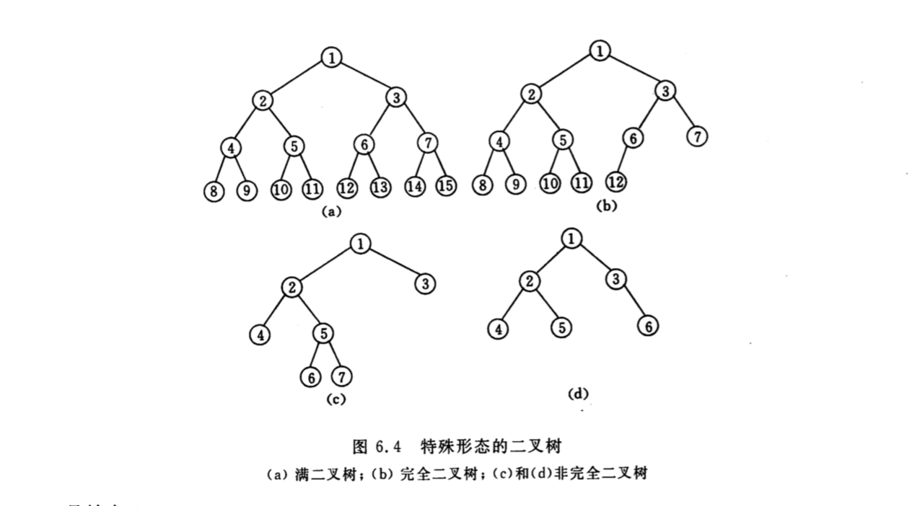
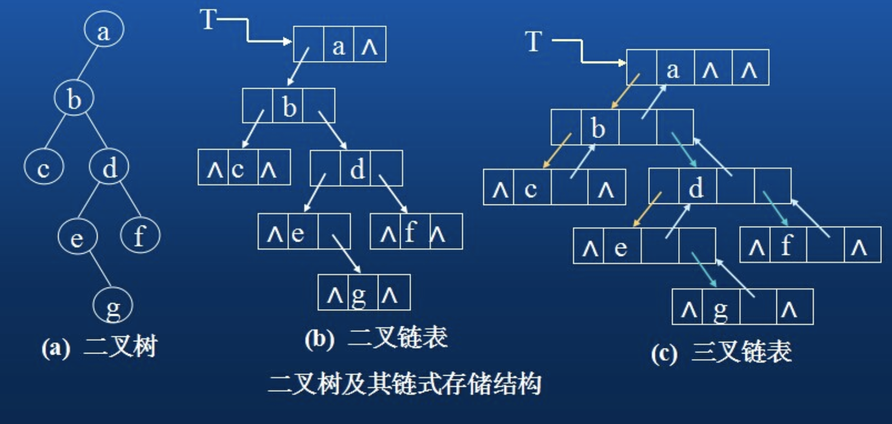

## 树和二叉树

树的结构定义是一个递归的定义；如果将树中结点的各子树堪称从左至右是有次序的(即不能呼唤)，则称该树为有序树，否则称为无序树

### 二叉树
特点
 - 每个节点至多只有两颗子树(即二叉树中不存在度大于2的结点)，二叉树的子树有左右之分，次序不能任意颠倒

性质
```javascript
 性质一
  - 在二叉树的第 i 层 至多有 2^(i-1) 个结点 

 性质二
  - 深度为k的二叉树至多有 2^k-1个结点

 性质三
  - 对任意一颗二叉树T，如果其终端结点树为 n0, 度为2的结点数为 n2， 则 n0 = n2 + 1

```

一颗深度为 k 且有 2^k -1 个结点的二叉树称为满二叉树，这种树的特点是每一层上的结点树都是最大结点树

深度为k，有n个结点的二叉树，当且仅当每一个结点都与深度为k的满二叉树中编号从1至n的结点一一对应时，称之为完全二叉树




n个结点的完全二叉树，结点按层次编号
```javascript
  i 的双亲是 n/2 (向下取整)，如果 i=1 时为根(无双亲)

  i 的左孩子是2i，如果2i > n，则无左孩子

  i的右孩子是2i+1，如果2i+1 > n ，则无右孩子

```

### 遍历二叉树
由于二叉树是一种非线性结构，每个结点都可能有两颗子树，二叉树由三个基本单元组成: 根结点(D)、左子树(L)、右子树(R)。若能依次遍历这三部分，便是遍历了整个二叉树。比如存在DLR、LDR、LRD、DRL、RDL、RLD这6中方案。若限定先左后右，则有3种情况: 先序遍历、中序遍历、后序遍历

以下边二叉树为例子，写出对应的先序、中序、后序


```javascript
  先序遍历 (根左右)
   - 若二叉树为空，则空操作
   - a. 访问根结点
   - b. 先序遍历左子树
   - c. 先序遍历右子树
   
   // 如上图，先序遍历的前缀表达式为：
   
   前缀表达式: -+a*b-cd/ef

```
```javascript
  中序遍历 (左根右)
   - 若二叉树为空，则空操作
   - a. 先序遍历左子树
   - b. 访问根结点
   - c. 先序遍历右子树
   
   // 如上图，先序遍历中缀表达式为：
   
   中缀表达式: a+b*c-d-e/f

```
```javascript
  后序遍历 (左右根)
   - 若二叉树为空，则空操作
   - a. 先序遍历左子树
   - b. 先序遍历右子树
   - c. 访问根结点
   
   // 如上图，先序遍历后缀表达式为：
   
   后缀表达式: abcd-*+ef/-

```
### 二叉树的顺序存储结构


### 二叉树的链式存储结构



## 递归实现二叉树的先序、中序、后序
```javascript
  function TreeNode (val) {
    this.val = val
    this.left = null
    this.right = null
  }

  // 先序遍历 (根左右)
  var preOrder = function (node) {
    if (node) {
      console.log(node.val)
      preOrder(node.left)
      preOrder(node.right)
    }
  }

  // 中序遍历 (左根右)
  var middleOrder = function (node) {
    if (node) {
      middleOrder(node.left)
      console.log(node.val)
      middleOrder(node.right)
    }
  }

  // 后序遍历 (左右根)
  var lastOrder = function (node) {
    if (node) {
      lastOrder(node.left)
      lastOrder(node.right)
      console.log(node.val)
    }
  }

```
### 实现创建一颗二叉树，并递归实现先序、中序、后序、查找最小值、查找最大值、查找给定值、删除结点

<!--more-->

```javascript
  /*
   * desc: 创建树结点
   * @params data: 结点数据value
   * @params left: 左结点树
   * @params right: 右结点树
  */
  var TreeNode = function (val, left, right) {
    this.val = val
    this.left = left
    this.right = right
  }
  
  var BST = function () {
    this.root = null
    this.insert = insert              // 插入结点，创建一棵树
    this.preOrder = preOrder          // 先序遍历
    this.middleOrder = middleOrder    // 中序遍历
    this.lastOrder = lastOrder        // 后序遍历
    this.getMin = getMin              // 查找最小值
    this.getMax = getMax              // 查找最大值
    this.getValue = getValue          // 查找给定值
    this.removeNode = removeNode      // 删除结点
  }

  // desc: 树结点插入到二叉树中
  var insert = function (val) {
    var node = new TreeNode(val, null, null)
    if (this.root == null) {
      this.root = node
    } else {
      var current = this.root
      while (true) {
        if (current.val > val) {        // 10，进 8， 10 > 8，8在10的左子树，进9，10 > 9
          if (current.left === null) {  // 10 的左子树不是null，所以current是指向8，继续while循环
            current.left = node         // 8 > 9 ？ 为false，进入else，这时候的右子树是null，所以9是8的右子树
            break
          }
          current = current.left
        } else {
          if (current.right === null) {
            current.right = node
            break
          }
          current = current.right
        }
      }
    }
  }

  // 先序遍历 (根左右)
  var preOrder = function (node) {
    if (node) {
      console.log(node.val)
      preOrder(node.left)
      preOrder(node.right)
    }
  }

  // 中序遍历 (左根右)
  var middleOrder = function (node) {
    if (node) {
      middleOrder(node.left)
      console.log(node.val)
      middleOrder(node.right)
    }
  }

  // 后序遍历 (左右根)
  var lastOrder = function (node) {
    if (node) {
      lastOrder(node.left)
      lastOrder(node.right)
      console.log(node.val)
    }
  }

  // 查找最小值，较小的值总是在左子节点上，只需遍历左子树
  var getMin = function () {
    var minNode = this.root
    while (!(minNode.left == null)) {
      minNode = minNode.left
    }
    return minNode.val
  }

  // 查找最大值，较大的值总是在右子节点上，只需遍历右子树
  var getMax = function () {
    var maxNode = this.root
    while (!(maxNode.right == null)) {
      maxNode = maxNode.right
    }
    return maxNode.val
  }

  /*
   * desc: 查找给定值, 需要比较该值和当前节点上的值的大小。通过比较，就能确定如果给定值不在当前节点时，该向左遍历还是向右遍历
   * desc: 如果找到给定值，该方法返回保存该值的节点;如果没找到，该方法返回 null
   * @params val: 查找的结点 val
  */
  var getValue = function (val) {
    var current = this.root
    while (current != null) {
      if(current.val == val) {
        return current
      } else if (current.val > val) {
        current = current.left
      } else {
        current = current.right
      }
    }
    return null
  }

  /*
   * 情况一: 如果待删除节点是叶子结点(也就是没有左右子树)，那么只需要将父节点指向它的链接指向null
   * 情况二: 如果待删除节点只包含是一个子结点，那么只需要将父节点指向它的链接指向它的子结点
   * 情况三: 如果待删除节点包含两个子节点，查找待删除节点右节点上的最小值，找到最小值后，将临时节点上的值复制到待删除节点，然后再删除临时节点
  */
  var removeNode = function (node, val) {
    if (node == null) {
      return null
    }
    if (node.val == val) {
      // 没有子节点（子树）
      if (node.left == null && node.right == null) {
        return null // 将结点置为空
      }
      // 只有右子节点（子树）
      else if (node.left == null) {
        return node.right // 
      }
      // 只有左子节点 (子树)
      else if (node.right == null) {
        return node.left
      }
      // 有两个结点 (子树)
      else {
        var tempNode = this.getRightSmall(node.right)
        node.val = tempNode.val
        node.right = this.removeNode(node.right, tempNode.val)
        return node
      }
    } else if (node.val > val) {
      node.left = this.removeNode(node.left, val)
      return node
    } else {
      node.right = this.removeNode(node.right, val)
      return node
    }
  }

  /*
   * desc: 获取给定节点下的二叉树最小值
   * @param {Node} node
  */
  var getRightSmall = function (node) {
    if (node.left == null) {
      return node
    } else {
      return getRightSmall(node.left) // 因为一棵树的最小值一定是在左子树上，遍历递归查找最小值
    }
  }

  var bst = new BST()
  bst.insert(10)
  bst.insert(8)
  bst.insert(15)
  bst.insert(6)
  bst.insert(9)
  bst.insert(13)
  bst.insert(20)
  bst.insert(3)
  bst.insert(4)

  console.log('先序遍历: ')
  console.log(bst.preOrder(bst.root))

  console.log('中序遍历: ')
  console.log(bst.middleOrder(bst.root))
  
  console.log('后序遍历: ')
  console.log(bst.lastOrder(bst.root))

  console.log('最小值: ', bst.getMin())
  console.log('最大值: ', bst.getMax())
  console.log('查找结点val = 4: ', bst.getValue(4))

  console.log('删除结点val=13', bst.removeNode(13))

```

### 非递归实现先序、中序、后序
前面的都是说递归遍历先中后，但是在面试过程中，面试官往往会问你，不用递归，你能给我写一下先中后序嘛？
非递归实现使用了栈的结构，通过栈的先进后出模拟递归实现。下面我们来试一试
```javascript
  /*
   * desc: 创建树结点
   * @params data: 结点数据value
   * @params left: 左结点树
   * @params right: 右结点树
  */
  var TreeNode = function (val, left, right) {
    this.val = val
    this.left = left
    this.right = right
  }
  
  var BST = function () {
    this.root = null
    this.insert = insert              // 插入结点，创建一棵树
    this.preOrder = preOrder          // 先序遍历
    this.middleOrder = middleOrder    // 中序遍历
    this.lastOrder = lastOrder        // 后序遍历
  }

  // desc: 树结点插入到二叉树中
  var insert = function (val) {
    var node = new TreeNode(val, null, null)
    if (this.root == null) {
      this.root = node
    } else {
      var current = this.root
      while (true) {
        if (current.val > val) {        // 10，进 8， 10 > 8，8在10的左子树，进9，10 > 9
          if (current.left === null) {  // 10 的左子树不是null，所以current是指向8，继续while循环
            current.left = node         // 8 > 9 ？ 为false，进入else，这时候的右子树是null，所以9是8的右子树
            break
          }
          current = current.left
        } else {
          if (current.right === null) {
            current.right = node
            break
          }
          current = current.right
        }
      }
    }
  }

  // 非递归先序遍历
  var preOrder = function (root) {
    if (root) {
      let stack = []
      // 先将根结点push
      stack.push(root)
      // 判断栈中是否为空
      while (stack.length > 0) {
        // 弹出栈顶元素
        popElement = stack.pop()
        console.log(popElement.val)
        // 先序遍历，根左右，栈是先进后出，也就是说，先压进右子树再压坐子树
        if (popElement.right) {
          stack.push(popElement.right)
        }
        if (popElement.left) {
          stack.push(popElement.left)
        }
      }
    }
  }
  
  // 非递归中序遍历
  var middleOrder = function (root) {
    if (root) {
      let stack = []
      // 中序遍历，左根右
      // 左子树遍历到底，然后依次入栈，当左子树到底，打印栈顶元素，然后寻找右结点
      // 对于最左边的叶节点来说，可以把它看成是两个 null 节点的父节点
      // 左边打印不出东西就把父节点拿出来打印，然后再看右节点
      while (stack.length > 0 || root) {
        if (root) {
          stack.push(root)
          root = root.left
        } else {
          popElement = stack.pop()
          console.log(popElement.val)
          root = popElement.right
        }
      }
    }
  }

  // 非递归后序遍历，使用两个栈
  var lastOrder = function (root) {
    if (root) {
      let stack1 = []
      let stack2 = []
      // 后序遍历是左右根
	    // 所以对于一个栈来说，应该先 push 根节点
      // 然后 push 右节点，最后 push 左节点
      stack1.push(root)
      while (stack1.length > 0) {
        popElement1 = stack1.pop() // 从栈1中pop出栈顶元素
        stack2.push(popElement1)
        if (popElement1.left) {
          stack1.push(popElement1.left)
        }
        if (popElement1.right) {
          stack1.push(popElement1.right)
        }
      }
      while (stack2.length > 0) {
        console.log(stack2.pop())
      }
    }
  }
  var bst = new BST()
  bst.insert(10)
  bst.insert(8)
  bst.insert(15)
  bst.insert(6)
  bst.insert(9)
  bst.insert(13)
  bst.insert(20)
  bst.insert(3)
  bst.insert(4)

  console.log('非递归先序遍历: ')
  console.log(bst.preOrder(bst.root))

  console.log('非递归中序遍历: ')
  console.log(bst.middleOrder(bst.root))
  
  console.log('非递归后序遍历: ')
  console.log(bst.lastOrder(bst.root))
  

```
